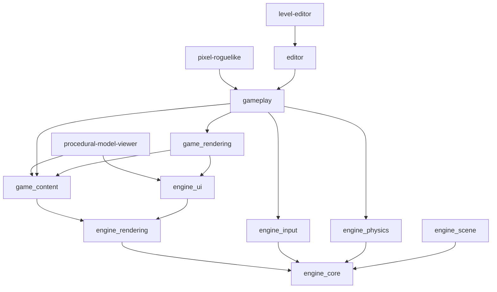

# Architecture

This repository is organized around a small set of CMake targets and a matching source layout. The top-level split is:

- `apps/` for executable entrypoints
- `src/engine/` for reusable engine systems
- `src/game/` for game-specific content, runtime, and rendering logic
- `src/editor/` for level-editor functionality built on top of the game and engine layers
- `tests/` and `tools/` for verification and offline helpers

## Target Graph

There is also a compatibility `game` interface target in [src/game/CMakeLists.txt](../src/game/CMakeLists.txt) that groups `game_content`, `game_rendering`, and `gameplay`.

## Layers

### `apps/`

- [apps/runtime](../apps/runtime) owns the playable runtime executable
- [apps/level_editor](../apps/level_editor) owns the editor executable
- [apps/model_viewer](../apps/model_viewer) owns the procedural model viewer

Entry points live here on purpose. The apps should stay thin and compose reusable library targets instead of owning large piles of implementation code directly.

### `src/engine/`

The engine layer is split into focused libraries:

- `engine_core`: windowing, application flow, path utilities, time
- `engine_rendering`: shaders, framebuffers, mesh loading, renderer, post-processing
- `engine_ui`: ImGui layer and screenshot helpers
- `engine_scene`: scene-manager glue
- `engine_input`: input system and shared runtime input state
- `engine_physics`: Jolt-backed physics runtime

This is the reusable substrate beneath both gameplay and editor code.

### `src/game/`

The game layer is split into three concrete targets:

- `game_content`: content definitions, level definition parsing, environment/material definitions, cathedral asset registration
- `game_rendering`: runtime scene rendering support and debug sync helpers
- `gameplay`: level loading/building, prefabs, session state, systems, and runtime game session logic

This split is meant to answer "what kind of game code is this?" before "which file should I open?"

### `src/editor/`

The editor is built as one `editor` library with internal subfolders:

- `assets/`: asset browser logic
- `core/`: commands, layout presets, runtime preview session, editor helpers
- `render/`: editor-specific scene and asset preview rendering
- `scene/`: editable scene document and selection logic
- `ui/`: outliner, inspector, environment, and asset-browser panels
- `viewport/`: viewport camera/controller and interaction glue

The editor is intentionally not a separate engine. It sits on top of gameplay and engine code so that it can edit and preview the same scene/content concepts the runtime uses.

## Key Runtime Data Flow

1. `ContentRegistry` loads gameplay definitions, materials, prefabs, and environments.
2. A scene `.scene` file is parsed into `LevelDef`.
3. Gameplay code turns that `LevelDef` into runtime entities, colliders, lighting, and archetype instances.
4. Rendering code resolves meshes, materials, sky data, and post-process settings.
5. The app target owns the window loop and hands execution to the relevant library targets.

## Key Editor Data Flow

1. The editor loads a scene file into `EditorSceneDocument`.
2. The document stores editable objects such as meshes, lights, colliders, player spawn, and archetype placements.
3. `EditorPreviewWorld` provides the edit-time visual preview.
4. `EditorRuntimePreviewSession` rebuilds a real `RuntimeGameSession` from the current document when play preview is toggled.
5. Saving writes scene/environment data back to the text asset formats under `assets/`.

## Repository Boundaries Worth Keeping

- New executables should live under `apps/`, not `src/`.
- Reusable engine logic belongs in `src/engine/`, even if it is first introduced for gameplay.
- Game-specific parsing, defs, runtime systems, and content logic belong in `src/game/`.
- Editor-only document, panel, and gizmo code belongs in `src/editor/`.
- Offline generators and maintenance helpers belong in `tools/`.

## Current Pragmatic Seams

The repo is cleaner than it was, but not every seam is perfect yet. One intentional pragmatic edge is that `engine_input` currently compiles `src/game/runtime/RuntimeInputState.cpp` because that input state is shared between runtime and editor preview flows. If that shared state grows substantially, it may deserve its own more neutral home later.
